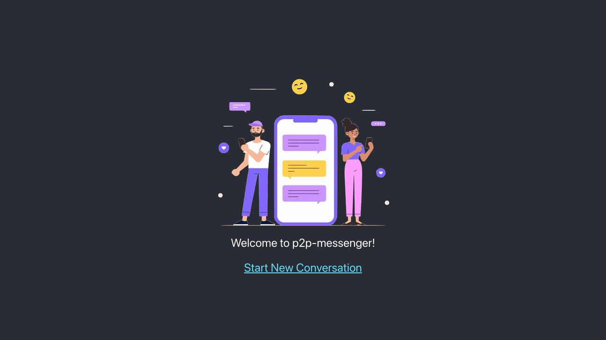
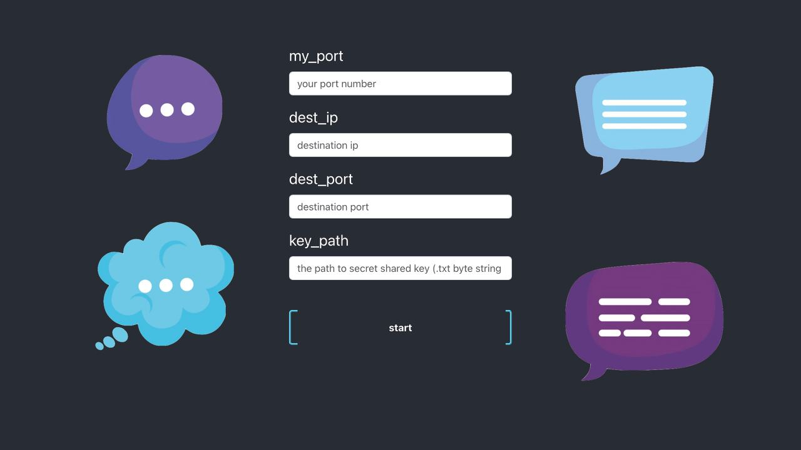
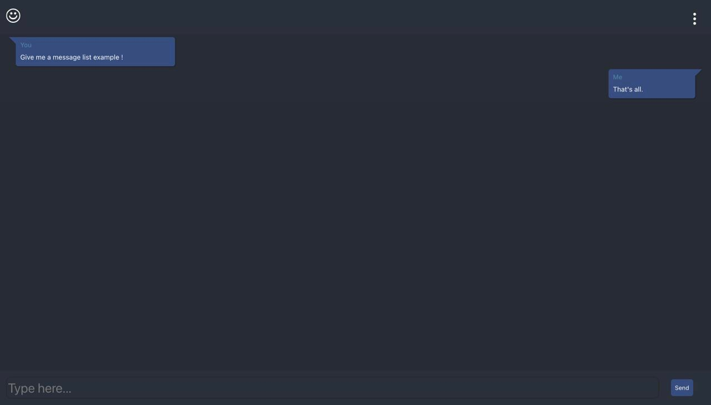

## P2P-Messenger-ui

#### About:

This project is the front end part of P2P-Messenger that uses message encryption using AES algorithm and completely serverless communication using Socket.
[Link to the backend repository](https://github.com/AmiriShavaki/P2P-Messenger)

## Project Screen Shot(s)

#### Welcome page:   

#### Set attributes page:

#### Chat screen:

## Installation and Setup Instructions
 

Clone down this repository. You will need `node` and `npm` installed globally on your machine.  

Installation:

`npm install`  
 

To Start Server:

`npm start`  

To Visit App:

`localhost:3000/`  

